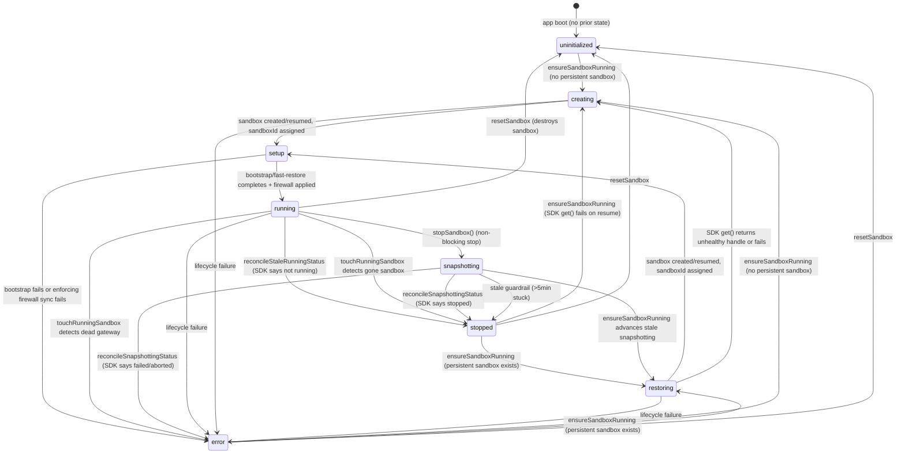
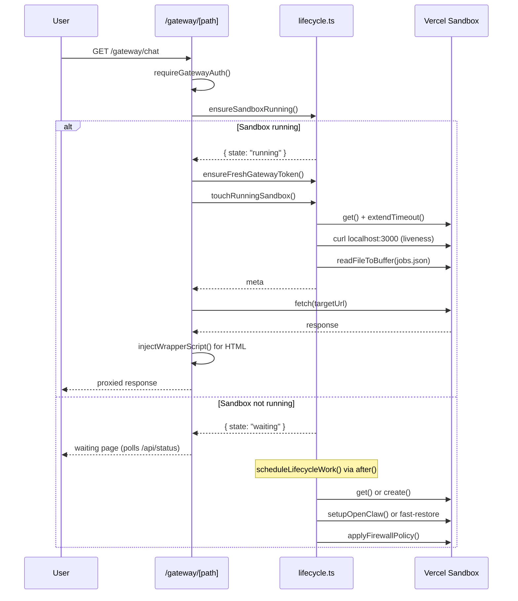
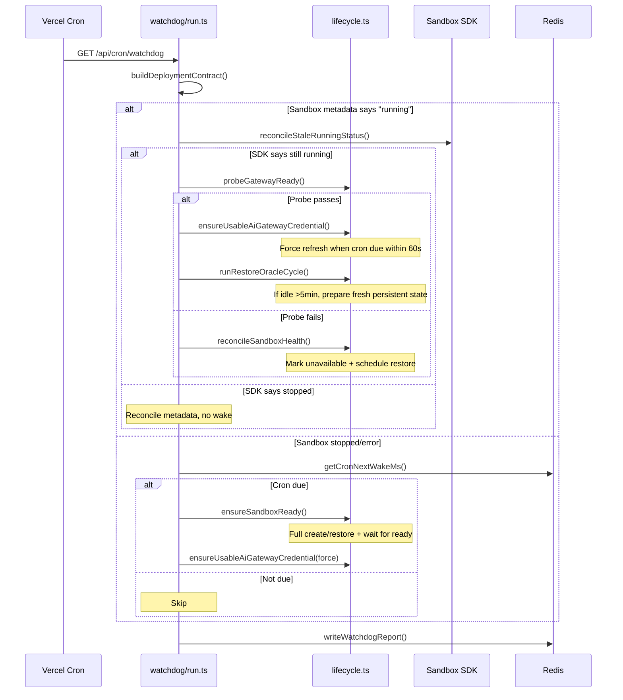
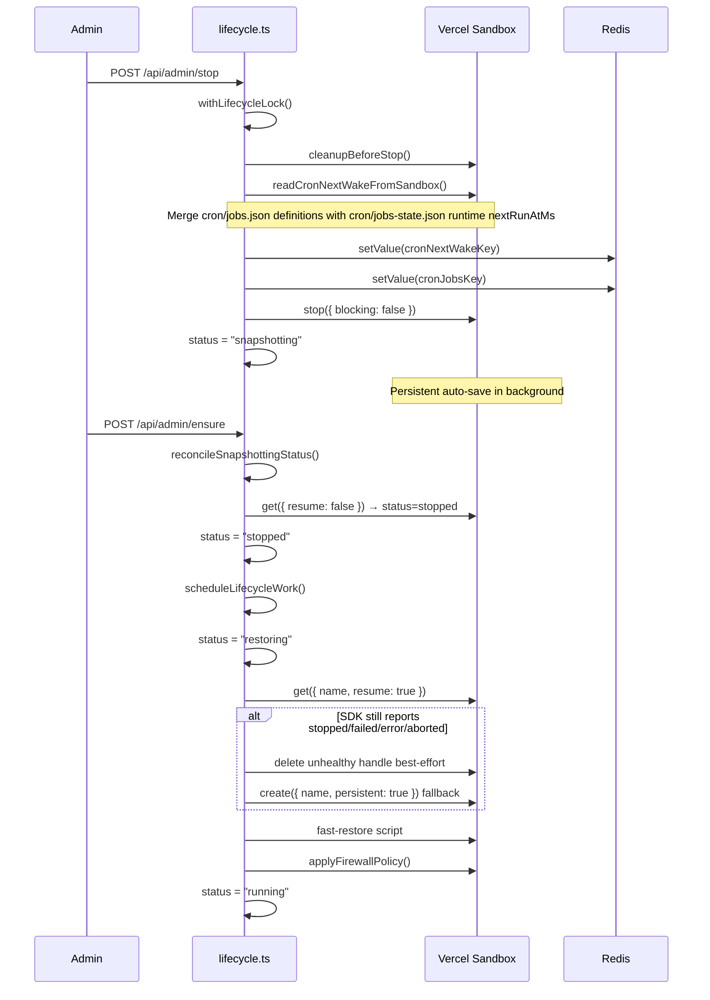
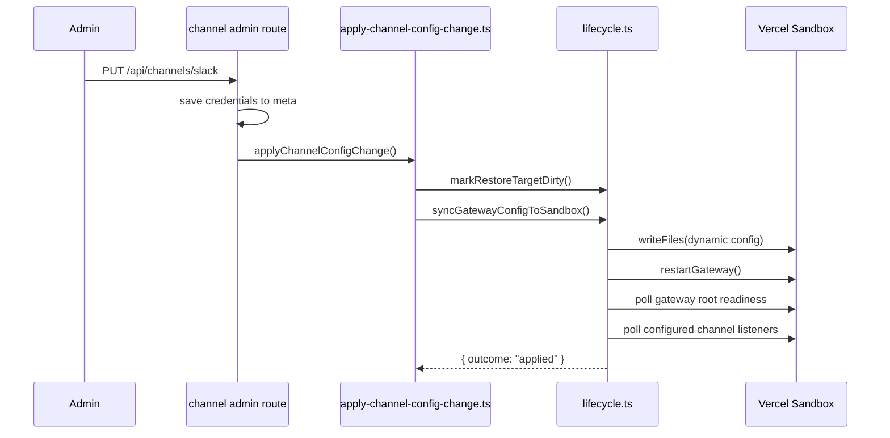
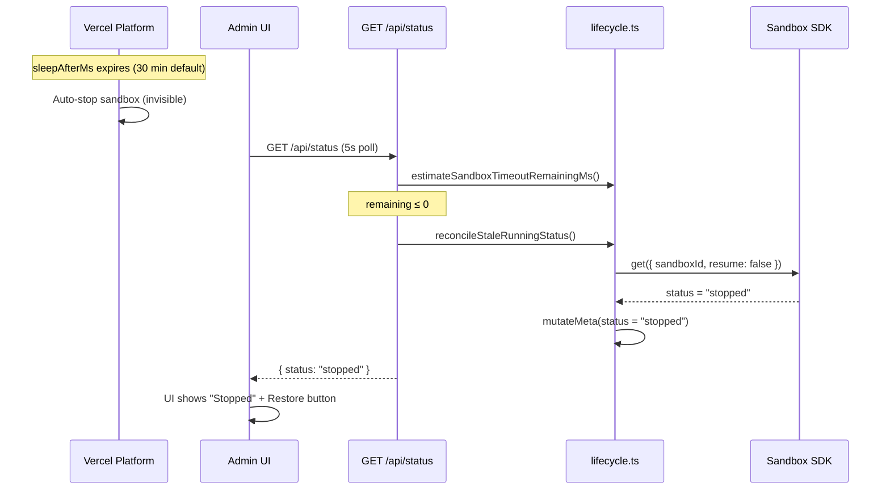
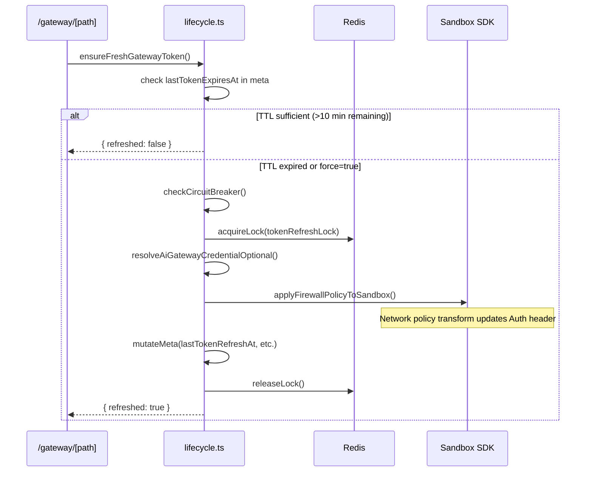

# Sandbox Lifecycle

Complete audit of every code path that creates, resumes, stops, sleeps, wakes, resets, or otherwise mutates the Vercel Sandbox state in the vercel-openclaw app.

## Status State Machine

The sandbox status is tracked in `SingleMeta.status` and follows this state machine. All transitions happen via [[src/server/sandbox/lifecycle.ts]] through `mutateMeta()`.

## Triggers — What Causes State Transitions

Every external event that can change the sandbox status, grouped by origin.

### User-initiated (Admin API)

Admin routes that directly trigger sandbox mutations via [[src/server/sandbox/lifecycle.ts]].

#### POST /api/admin/ensure

Calls `ensureSandboxRunning()` (async) or `ensureSandboxReady()` (with `?wait=1`).

The `schedule: after` parameter defers the heavy create/restore work to a Next.js `after()` callback. This is the primary "wake up the sandbox" trigger from the admin UI.

#### POST /api/admin/stop

Calls `stopSandbox()`. Acquires lifecycle lock, runs pre-stop cleanup, persists cron jobs, calls `sandbox.stop({ blocking: false })`, and transitions to `snapshotting` while Sandbox v2 auto-saves persistent state.

#### POST /api/admin/snapshot

Alias for `stopSandbox()` via `snapshotSandbox()`.

#### POST /api/admin/reset

Calls `resetSandbox()` via `after()`. Destroys the sandbox, deletes all tracked snapshots, clears cron state, transitions to `uninitialized`.

#### POST /api/admin/snapshots (manual snapshot)

Takes a manual snapshot of the running sandbox, bypassing `stopSandbox()`.

Calls `sandbox.snapshot()`, records in `snapshotHistory` (cap 50), sets `snapshotId`, clears `sandboxId`, transitions to `stopped`. No pre-snapshot cleanup, no cron persistence, no non-blocking stop.

#### POST /api/admin/snapshots/restore

Restores from a specific snapshot in history. Sets `snapshotId` to the target, clears `sandboxId`, transitions to `stopped`, then calls `ensureSandboxRunning()` to trigger the restore. This is a sandbox lifecycle trigger.

#### POST /api/admin/snapshots/delete

Deletes a snapshot from Vercel and removes it from `snapshotHistory`. Cannot delete the current `snapshotId` — returns 409. If the Vercel API returns 404 (already gone), the history entry is still cleaned up.

#### POST /api/admin/prepare-restore

Calls `prepareRestoreTarget()`. When `destructive: true`, reconciles dynamic config, syncs assets, verifies gateway readiness, stops the persistent sandbox to auto-save state, and stamps persisted-state hashes. Used by launch-verify.

#### POST /api/admin/refresh-token

Calls `ensureFreshGatewayToken({ force: true })`. Refreshes the OIDC token and updates the firewall network policy.

### Gateway traffic (Proxy)

The `src/app/gateway/[[...path]]/route.ts` proxy route triggers sandbox state changes on every incoming request.

#### Gateway request flow

Step-by-step sequence of sandbox interactions during a proxied gateway request.

1. Auth check (admin cookie or bearer)
2. `ensureSandboxRunning()` — if not running, schedules create/restore and returns waiting page
3. `ensureFreshGatewayToken()` — proactive OIDC refresh (throttled)
4. `touchRunningSandbox()` — extends timeout, persists cron wake, detects dead gateway
5. If `touchRunningSandbox` finds sandbox gone → `ensureSandboxRunning()` re-triggered
6. Proxy to sandbox, handle 401 (force token refresh + retry) and 410 (reconcile health)

### Heartbeat (Status API)

Browser-injected JavaScript and the admin UI poll the status API to keep the sandbox alive.

The admin UI fast-polls transitional lifecycle states, including `snapshotting`, so a Stop action keeps reading `/api/status` until the SDK-confirmed state changes. The UI only shows the snapshotting wedge warning after the server's 5-minute stale guardrail has had time to run.

#### POST /api/status

Called by the injected browser JavaScript every `heartbeatIntervalMs` (~4 min). Calls `touchRunningSandbox()` which extends the sandbox timeout and runs gateway liveness checks.

#### GET /api/status

Returns sandbox state. When metadata says "running" but estimated timeout elapsed, calls `reconcileStaleRunningStatus()`. When status is "snapshotting", calls `reconcileSnapshottingStatus()`.

During a non-blocking stop, repeated GET polls may legitimately keep returning `snapshotting` while the SDK still reports that state. The host transitions to `stopped` only after the SDK reports `stopped`, the sandbox disappears, or the stale guardrail forces recovery.

The stop path must park metadata in `snapshotting` before calling `sandbox.stop({ blocking: false })`, so concurrent heartbeats stop treating the sandbox as `running`. Snapshotting reconciliation must call the SDK with `resume: false`. Observation must use `resume: false`; normal wake uses `resume: true`, so a status poll with the wake path can restart the sandbox it is trying to observe and leave the UI waiting until the stale guardrail fires.

Unit tests use the fake sandbox controller, so they validate this polling contract but cannot measure real Vercel snapshot duration. Deployed-app timing runs use `scripts/bench-stop-cycle.mjs` with `--sdk-poll`; linked-project SDK timing runs use `scripts/bench-sdk-snapshot.mjs`, including its bundle workload for the same artifact path as `vclaw create`.

### Watchdog (Cron)

The [[src/app/api/cron/watchdog/route.ts]] cron route runs periodically (configured in vercel.json). It delegates to [[src/server/watchdog/run.ts]] `runSandboxWatchdog()`.

Cron incidents use the repo-local `cron_watchdog` Codex specialist and `$cron-watchdog-debug` skill. The investigation separates Vercel Cron invocation, route authorization, due wake state, sandbox wake, AI Gateway token refresh, OpenClaw scheduler loading, and user-visible delivery.

#### Watchdog decision tree

Ordered checks the watchdog runs on each tick to determine what action (if any) to take.

1. **Deployment contract check** — verifies env vars and configuration
2. **Stuck busy detection** — if status is creating/restoring/setup/booting with no sandboxId for >90s, triggers repair via `reconcileSandboxHealth()`
3. **Not running** — watchdog does NOT wake idle sandboxes (skips)
4. **Running — stale check** — calls `reconcileStaleRunningStatus()`. If SDK says stopped, metadata reconciled, no wake
5. **Running — gateway probe** — calls `probeGatewayReady()`
   - **Probe passes** → refreshes/validates the AI Gateway transform, force-refreshing when a sandbox-local cron is due soon, then runs restore oracle cycle (prepare next restore target if idle enough)
   - **Probe fails** → `reconcileSandboxHealth()` marks unavailable and triggers restore
6. **Cron wake** — if sandbox is stopped/error with resumable target and `cronNextWakeMs <= now`, calls `ensureSandboxReady()` to wake the sandbox for scheduled jobs and force-refreshes the AI Gateway transform after wake

#### Cron debugging handoff

Cron wake debugging starts with deployment proof and raw runtime evidence under `.agent-runs/cron-debug/<timestamp>/`.

The required handoff includes a watchdog path diagram, a hypothesis table, sanitized cron job shape, watchdog report checks, and the first `verified-bad` edge. Agents must not print job payload text or secrets; they report counts, ids, next-run timestamps, and whether the OpenClaw scheduler loaded jobs.

The matching Codex role is `.codex/agents/cron-watchdog.toml`. Its reusable playbook is `.agents/skills/cron-watchdog-debug/SKILL.md`, with the incident handoff template in `.agents/skills/cron-watchdog-debug/references/handoff-template.md`.

### Channel webhooks (Slack, Telegram, WhatsApp, Discord)

Incoming webhook messages reconcile stale state and can trigger full sandbox wakes.

Channel debugging uses repo-local Codex specialists plus reusable skills to keep evidence gathering consistent across Slack, Telegram, Discord, and WhatsApp without expanding the always-loaded project instructions.

The dispatcher lives in `AGENTS.md`; project-scoped specialists live under `.codex/agents/`; reusable playbooks live under `.agents/skills/`. Specialists must report route-ready, native-accepted, and user-visible-reply as separate states before proposing channel fixes.

#### Parallel live-incident investigation

Live channel incidents start with parallel evidence lanes, not serial debugging.

The parent agent creates `.agent-runs/channel-debug/<timestamp>/<channel>/` and runs four lanes: Vercel/app logs, sandbox runtime, Workflow state, and the channel specialist. Before any CLI lane runs, agents compare `.vercel/project.json` to the intended incident project/team/deployment and use explicit targeting when the repo is linked to a different release.

The Vercel/app logs lane collects deployment proof, admin readiness JSON, project targeting proof, and `vercel logs` correlation. The sandbox runtime lane uses the actual Vercel Sandbox ID with `sandbox exec` / `sandbox connect`, or the app admin SSH/exec fallback when CLI access is incompatible. `oc-prj*`, `prj_*`, `OPENCLAW_INSTANCE_ID`, and `VERCEL_PROJECT_ID` are not accepted as positional sandbox IDs. The Workflow lane uses `npx workflow inspect runs --backend vercel` for `drainChannelWorkflow` state and falls back to Vercel/admin logs when the CLI cannot inspect remote state.

A channel specialist may propose a patch only after the lane merge gate: each lane has a handoff or documented fallback, at least one edge is `verified-bad`, and current evidence has been compared to prior failure signatures such as openclaw-42, stale sandbox URL, workflow retry exhaustion, and channel-specific signature or secret failures.

#### Slack debug sender

Real Slack debug messages use an OAuth user token, not Slack CLI app credentials.

The operator tool `scripts/slack-debug-send.mjs` sends one user-authored Slack message through `chat.postMessage`, verifies token identity with `auth.test`, and writes sanitized correlation output under `.agent-runs/channel-debug/<timestamp>/slack/channel/`. This is the repeatable CLI path for triggering the same Events API delivery that a Slack UI message would trigger, while keeping `SLACK_USER_TOKEN` out of artifacts and logs. The setup and internal Slack app manifest are documented in `docs/slack-debug-sender.md`.

Each channel webhook route (`src/app/api/channels/{slack,telegram,whatsapp,discord}/webhook/route.ts`) uses a two-phase approach:

**Phase 1 — Fast path (webhook route itself):** If sandbox appears running, the route forwards directly to the channel native handler surface. Telegram uses the live port 8787 handler even when restore listener metrics are unverified; those metrics are logged as evidence, not used as a hard fast-path gate. Slack, Telegram, and WhatsApp first call `refreshChannelFastPathGatewayToken()` so the firewall's AI Gateway Authorization transform is fresh before OpenClaw handles the message. Slack does not post a wrapper `_Thinking..._` message on the running fast path; typing or assistant status belongs to OpenClaw's native Slack handler. On network failure OR gateway-error HTTP status (502/503/504 — indicating the sandbox process is unreachable, e.g. platform auto-sleep), it records the concrete failure and falls through to the workflow wake path. When Telegram receives the exact Vercel 502 body saying port 8787 is not listening, it marks the cached URL stale and retries the refreshed 8787 URL once before sending a boot message or starting the workflow. If that one repair retry accepts, the webhook returns immediately and records `lastForward.attempts=2`; if it fails, the workflow wake path owns recovery. Non-gateway HTTP errors (4xx, 500) are treated as "handler received the payload" to avoid duplicate delivery.

Telegram fast-path outcomes are classified by [[src/server/channels/core/fast-path-classifier.ts]] and planned by [[src/server/channels/core/webhook-planner.ts]]. A typed `fallback-to-workflow` outcome always maps to workflow reason `fast-path-fallback` and user notice `send-before-workflow` when a Telegram chat can receive the notice, even if metadata still says `running`. Accepted fast-path deliveries also emit the same `channels.telegram_webhook_plan` event before returning, so the planner log is the route decision record for both delivered and workflow-handoff paths.

**Phase 2 — Workflow wake path:** If the sandbox isn't running or the fast path fails, the route starts a Vercel Workflow (`drainChannelWorkflow`) that calls `ensureSandboxReady()` (blocking until sandbox is running). Slack and Telegram send a wake boot message before starting the workflow for immediate feedback. Slack posts that message in the user thread, using `event.thread_ts` when present and falling back to the top-level user message `event.ts`. The shared boot loop polls sandbox state during wake, reads setup-progress phases while metadata remains in coarse `setup`, and updates the message with finer steps such as syncing channel config, starting the OpenClaw gateway, waiting for the gateway, or verifying the channel route/listener. Telegram performs at most one local 8787 readiness probe as a transport hint and lets the retrying forward loop own readiness instead of running a serial public probe loop. If workflow start fails, the boot message is best-effort deleted. After the native Slack handler accepts the event, the workflow deletes the wrapper boot message instead of leaving a final "Message sent" status. After the native Telegram handler accepts the update, the workflow deletes the wrapper boot message so it cannot linger next to the real bot reply.

The Telegram webhook also has a dedup lock (24h TTL) to prevent duplicate processing of the same `update_id`. If the workflow start fails after dedup lock acquisition, the lock is released so Telegram can redeliver.

Slack stopped-sandbox wake coverage lives in [[src/app/api/channels/slack/webhook/route.test.ts]]. The route test signs a real Slack payload, parks metadata in `stopped` with a snapshot, verifies the immediate Slack boot message, and asserts that the workflow envelope preserves `slackForwardHeaders` plus `slackRawBody` so the resumed sandbox can replay the event through OpenClaw's native Slack receiver. Discord and WhatsApp use the same workflow replay principle: their webhook routes preserve the raw body and provider signature headers in `workflowHandoff`, and `drainChannelWorkflow` forwards those payloads through the retrying native-handler loop after wake. WhatsApp status-only callbacks are logged and skipped before workflow start, while handler-not-ready fast-path responses fall through to the workflow instead of ending as terminal success.

VClaw-generated Slack config sets `replyToMode="all"` and partial native streaming. This gives top-level Slack messages a thread target so OpenClaw can use assistant thread status and native streaming instead of wrapper-created placeholder messages. The Slack app creation flow also uses the optional app-name override for both `display_information.name` and `bot_user.display_name`, while keeping the slash command project-derived.

Remote smoke coverage uses [[src/server/smoke/remote-smoke.ts]] and keeps Vercel edge bypass separate from app auth: `x-vercel-protection-bypass` proves Deployment Protection access, while `Authorization: Bearer` proves `ADMIN_SECRET` access. The wake profile reads [[src/server/smoke/remote-phases.ts#channelsSummary]] instead of probing by sending empty webhooks, then sends one real wake payload after the sandbox is stopped.

Key sandbox interactions in the workflow:
- `runWithBootMessages()` → `ensureSandboxReady()` — blocks until sandbox is running
- `getSandboxDomain()` — gets the sandbox URL for forwarding
- `ensureUsableAiGatewayCredential()` — refreshes OIDC token if needed
- Forward to native handler on port 8787 (Telegram) or port 3000 (others)
- Workflow observability — `npx workflow inspect runs --backend vercel` should be used to inspect `drainChannelWorkflow` run state during live incidents; if unavailable, correlate `channels.<ch>_workflow_started`, `channels.forward_attempt`, and `channels.forward_outcome` from Vercel logs and `/api/admin/logs`.

### Channel config changes

When channel credentials are saved/removed via admin routes, [[src/server/channels/admin/apply-channel-config-change.ts]] calls:
1. `markRestoreTargetDirty()` — marks next restore as stale
2. `syncGatewayConfigToSandbox()` — writes new config files, restarts gateway, polls Slack and Telegram listener readiness

Telegram readiness is confirmed by probing the native listener on port 8787 for a secret-required response. Failures are recorded in restore metrics and surfaced by `why-not-ready` with the probe status and error context.

### Firewall policy changes

`applyFirewallPolicyToSandbox()` in [[src/server/firewall/policy.ts]] calls `sandbox.updateNetworkPolicy()`. Triggered during:
- Fresh sandbox create (after bootstrap)
- Persistent sandbox resume (after fast-restore)
- Token refresh (`refreshAiGatewayToken`)
- Dynamic config reconciliation

### Platform-initiated (Implicit)

The Vercel Sandbox platform auto-stops sandboxes after `sleepAfterMs` (default 30 min). This is invisible to the app — metadata still says "running" until something reconciles:
- `touchRunningSandbox()` detects via SDK status check
- `reconcileStaleRunningStatus()` detects via SDK get()
- `estimateSandboxTimeoutRemainingMs()` predicts via timestamp math
- GET /api/status reconciles when estimated timeout ≤ 0

## Key Lifecycle Functions

Detailed behavior of each function in [[src/server/sandbox/lifecycle.ts]].

### ensureSandboxRunning

Entry point for "make the sandbox available." Does NOT block — returns `{ state: "running" | "waiting" }`. Schedules heavy work via `scheduleLifecycleWork()`.

Decision tree:
1. If `snapshotting` → try `reconcileSnapshottingStatus()` first
2. If `running` with sandboxId → check estimated timeout. If expired, `reconcileSandboxHealth()`. Otherwise return running.
3. If busy status (creating/setup/restoring/booting/snapshotting) → if stale (>5min), re-schedule; else return waiting
4. Otherwise → schedule resume by persistent sandbox name, or create if no persistent sandbox exists

### stopSandbox

Acquires lifecycle lock. Pre-stop cleanup removes logs and temp files. Reads cron jobs from sandbox and persists to store. Calls `sandbox.stop({ blocking: false })`. Transitions to `snapshotting`. Optionally pre-creates a hot-spare sandbox.

Edge case: if sandbox is already gone (404/410 from SDK), transitions to `uninitialized` instead of throwing.

### touchRunningSandbox

Called by heartbeat and gateway proxy. Throttled to `touchThrottleMs` (~7.5s). Extends sandbox timeout, checks SDK status, runs internal gateway liveness curl, persists cron wake time.

If SDK says sandbox not running → `markSandboxUnavailable()`.
If gateway liveness curl fails → `markSandboxUnavailable()`.
If extend timeout fails → `markSandboxUnavailable()`.

### createAndBootstrapSandbox

The heavy lifting. Acquires lifecycle + start locks.

1. Hot-spare promotion (if enabled): try to promote pre-created candidate
2. `getSandboxController().get({ name, resume: true })` — resumes the named persistent sandbox
3. If get() returns unhealthy handle (failed/error/aborted) → delete it, fall back to create()
4. If get() throws → fresh `create()` with persistent=true
5. Detect resumed vs fresh via `which openclaw` stat check
6. **Resumed path**: fast-restore script (update tokens/config, restart gateway), firewall policy, record metrics
7. **Fresh path**: full `setupOpenClaw()` bootstrap, firewall policy
8. Transition to `running`

### Bundle bootstrap artifacts

When `OPENCLAW_BUNDLE_URL` is set, [[src/server/openclaw/bootstrap.ts]] downloads the bundle and sibling release assets needed by the fast bootstrap path.

The bundle path downloads these release assets relative to the `openclaw.bundle.mjs` URL:

- `openclaw.bundle.mjs` — the single-file ESM gateway bundle.
- `channel-catalog.json` — copied to `/home/vercel-sandbox/dist/channel-catalog.json` so config validation recognizes bundled channel IDs. The generated gateway config allowlists bundled channel plugin IDs with `plugins.allow`; it must not emit the legacy `plugins.bundledDiscovery` key because current bundles reject that config field.
- `workspace-templates.tar.gz` — extracted under `/home/vercel-sandbox/docs/reference` so chat-time workspace template reads succeed.
- `channels.tar.gz` — extracted into [[src/server/openclaw/config.ts#OPENCLAW_BUNDLED_PLUGINS_DIR_PATH]] so the gateway's plugin discovery finds each channel extension on disk. This path must stay under the bundle package root's `dist/extensions` trust boundary; `/home/vercel-sandbox/extensions` is ignored by current bundles.
- `bundle-deps.tar.gz` — extracted into `/home/vercel-sandbox/` so runtime externals and shared channel chunks can resolve root-level `node_modules/` packages next to the bundle.
- `bundle-openclaw-pkg.tar.gz` — extracted into `/home/vercel-sandbox/` to provide `node_modules/openclaw/plugin-sdk/*` shims for bundled plugin imports. It can overwrite root `package.json`, so bootstrap rewrites that file back to `name: "openclaw"` after extraction; the bundle package-root resolver depends on that identity. Bootstrap also mirrors `node_modules/openclaw/dist/plugins/runtime/index.js` to `/home/vercel-sandbox/dist/plugins/runtime/index.js` when present so bundled channel handlers can resolve the plugin runtime from the sandbox package root.
- `channel-shared-chunks.tar.gz` — extracted into `/home/vercel-sandbox/` so channel extension files can import their shared chunks. Bootstrap also mirrors root `*.js`/`*.cjs` files into `/home/vercel-sandbox/dist` because imports from `dist/extensions/<channel>` resolve `../../chunk.js` to `dist/<chunk>.js`. Compatibility shims are written under both root (`agents/`, `config/`, `plugins/`) and `dist/` because bundled runtime chunks can import either location; the provider-discovery shim also restores the non-minified `resolvePluginDiscoveryProvidersRuntime` export name used by model catalog loading. When a bundle already ships `dist/agents/pi-model-discovery-runtime.js`, bootstrap copies that stable shim to the root `agents/` path instead of reconstructing it from minified chunk exports. Agent runtime shims otherwise restore stable export names for pi model discovery, models config writes, and bundled MCP session runtime so Slack delivery can continue past OpenClaw model-catalog startup in bundle mode.
- `control-ui.tar.gz` — extracted into `/home/vercel-sandbox/dist` for gateway Control UI assets.

The deps, channel, shim, shared-chunk, and UI downloads are best-effort: if an older bundle lacks a sidecar, bootstrap logs a warning and continues so launch verification and gateway logs expose the missing runtime surface.

### reconcileSandboxHealth

Single authority for health checks. When metadata says "running", probes the gateway. If probe fails, marks unavailable and schedules recovery via `ensureSandboxRunning()`. Also force-refreshes the OIDC token on success.

### resetSandbox

Acquires lifecycle lock. Stops sandbox (best-effort), deletes it, deletes all tracked snapshots, clears cron state, resets all metadata to default. Transitions to `uninitialized`.

Token and breaker metadata is also cleared (`lastTokenRefreshAt`, `lastTokenExpiresAt`, `lastTokenSource`, `lastTokenRefreshError`, `consecutiveTokenRefreshFailures`, `breakerOpenUntil`) so a fresh sandbox does not inherit stale TTL that would trick `ensureUsableAiGatewayCredential` into skipping a needed refresh.

## Locking

Three distributed locks prevent concurrent mutations:

### Lifecycle lock

Key: `openclaw-single:lifecycle-lock`. TTL: 90s with auto-renewal every 25s. Guards `stopSandbox`, `resetSandbox`, `createAndBootstrapSandbox`. Contention returns `409 LIFECYCLE_LOCK_CONTENDED`.

### Start lock

Key: `openclaw-single:start-lock`. TTL: 90s with auto-renewal. Guards `scheduleLifecycleWork` — prevents two concurrent create/restore operations.

### Token refresh lock

Key: `openclaw-single:token-refresh-lock`. TTL: 60s. Guards OIDC token refresh with a bounded wait (5s polling at 500ms intervals).

## Cron Wake

Cron jobs inside the sandbox have scheduled next-run times. Before stop/sleep:
- `readCronNextWakeFromSandbox()` reads `jobs.json` and optionally merges runtime state from `jobs-state.json`
- Earliest `nextRunAtMs` stored in Redis at `openclaw-single:cron-next-wake-ms`
- Full merged `jobs.json` stored in Redis at `openclaw-single:cron-jobs-json` (structured record with SHA-256)
- `touchRunningSandbox()` also piggybacks cron persistence on heartbeats

Malformed `jobs-state.json` is ignored so valid `jobs.json` still persists. Both nested `jobs[id].state` and direct runtime fields are accepted.

On watchdog tick:
- If sandbox is running and cron is due within 60s → force-refreshes the AI Gateway transform without waking or running completions
- If sandbox stopped/error AND `cronNextWakeMs <= now` → `ensureSandboxReady()` wakes it, then force-refreshes the AI Gateway transform
- After wake, checks `cronRestoreOutcome` to decide whether to clear the wake key

## Cron Channel Targets

Scheduled chat jobs separate delivery routing from generated content.

OpenClaw cron jobs use the delivery metadata restored by [[src/server/sandbox/lifecycle.ts#readCronNextWakeFromSandbox]] to decide where announced results are posted. Slack jobs must set an explicit `delivery.to` target, normally `channel:<id>` for channel posts or `user:<id>` only for explicit DMs. The prompt should ask the agent to generate the message body, not resolve a person or decide whether to DM.

## Token Refresh

AI Gateway credentials (OIDC tokens) expire. The refresh system uses:
- **TTL check**: based on `lastTokenExpiresAt` in metadata (not function-local OIDC tokens)
- **Circuit breaker**: opens after 3 consecutive failures, stays open for 30s
- **Distributed lock**: prevents redundant concurrent refreshes
- **API key bypass**: static API keys never need refresh

Refresh writes the new token to the firewall network policy transform rules — no file writes or gateway restarts needed.

## Hot Spare (Feature-flagged)

When `OPENCLAW_HOT_SPARE_ENABLED=true`:
- After `stopSandbox()` → `preCreateHotSpare()` creates a candidate sandbox
- After watchdog oracle prepare → `preCreateHotSpareFromSnapshot()` creates a candidate from the prepared persisted state
- On next wake → `promoteHotSpare()` promotes candidate to active, skipping create latency
- If promotion fails → falls through to normal create/resume path

## Restore Attestation and Decision Logic

Determines whether the current persisted sandbox state is reusable for a fast resume, defined in [[src/server/sandbox/restore-attestation.ts]].

### Attestation

Compares desired vs actual hashes for dynamic config and static assets.

Persisted state is `reusable` when `restorePreparedStatus === "ready"`, `persistedStateDynamicConfigHash` matches desired dynamic config, and `persistedStateAssetSha256` matches desired static assets. Manual `snapshotId` is not required for normal v2 resume; mismatch reasons use `persisted-state-*` names while legacy `snapshot-*` reasons remain for compatibility.

### Restore Decision

Wraps attestation + plan + runtime context into a single canonical decision object.

Used by `prepareRestoreTarget()`, the restore oracle, and the status API. Sources: `inspect` (non-destructive check), `prepare` (destructive), `oracle` (watchdog-triggered), `watchdog`.

### Restore Plan

`buildRestoreTargetPlan()` converts attestation into an action list. If not reusable: `ensure-running` (if sandbox not running) + `prepare-destructive` (always). If reusable: empty action list, `status: "ready"`.

## Restore Oracle

The watchdog runs `runRestoreOracleCycle()` when the sandbox is running and the gateway probe passes.

**Guard chain (all must pass to execute):**
1. Attestation not already reusable
2. Oracle not already running (CAS check via `beginOracleRun`)
3. Sandbox status is "running" with a sandboxId
4. Idle time > `minIdleMs` (default 5 min) unless `force: true`
5. Gateway probe passes

**Execution:** Calls `prepareRestoreTarget({ destructive: true })` which reconciles config, syncs assets, verifies gateway, stops the persistent sandbox so v2 auto-saves state, and stamps persisted-state metadata as "ready".

**Oracle state machine:** `idle` → `pending` (when config changes) → `running` (during prepare) → `ready`/`failed`/`blocked`. Consecutive failures tracked for diagnostics.

## Launch Verification

`POST /api/admin/launch-verify` is the production readiness entrypoint.

**Phase pipeline:** preflight → ensureRunning → queuePing → chatCompletions → wakeFromSleep → restorePrepared. Each phase runs sequentially; blocking preflight failures skip all subsequent phases.

The `restorePrepared` phase calls `runRestoreOracleCycle({ force: true, minIdleMs: 0 })` — bypasses idle-time and force guards — so launch-verify always attempts a destructive prepare. This is the only caller that forces the oracle.

Supports NDJSON streaming (`Accept: application/x-ndjson`) with per-phase progress events. The terminal `result` event carries the full `LaunchVerificationPayload` including `channelReadiness`.

## Vercel Sandbox API Audit

The audit documents every Vercel Sandbox SDK surface used by the app and the lifecycle risks that need explicit ownership.

The full report lives in `docs/vercel-sandbox-api-audit.md`. It preserves the controller boundary around [[src/server/sandbox/controller.ts]], records that normal lifecycle uses `Sandbox.get({ resume: true })` before `Sandbox.create(...)`, and calls out beta-SDK risks around status names, network policy forms, snapshot metadata, and error shapes.

### Snapshot Truth Model

Persistent sandbox stop relies on Vercel Sandbox v2 auto-save behavior, so metadata must not require a manual snapshot ID for normal restore-prepared decisions.

`stopSandbox()` parks metadata in `snapshotting` and calls `sandbox.stop({ blocking: false })`; `reconcileSnapshottingStatus()` observes with `resume: false`. Restore-prepared decisions use `persistedState*` metadata as the normal source of truth. `snapshotId` and `snapshotHistory` are manual/legacy checkpoint state only.

### Credential Brokering Claim

The AI Gateway security claim must match the actual sandbox environment and network policy behavior.

The firewall transform keeps the host-side policy in control, but `buildRuntimeEnv()` can also pass `AI_GATEWAY_API_KEY` and `OPENAI_API_KEY` into sandbox creation env. Documentation and threat modeling must describe that bootstrap exception unless the code changes to make network-policy-only credential brokering true.

### SDK Compatibility Surface

Beta SDK behavior should be validated at the small set of app-critical boundaries.

Contract coverage should focus on `Sandbox.get` resume flags, `Sandbox.create`, `sandbox.stop` blocking modes, `sandbox.domain`, `sandbox.runCommand` output shape, `sandbox.update({ networkPolicy })`, `Snapshot.get/delete`, and `APIError` status fields. These surfaces define whether lifecycle, firewall, reset, diagnostics, and worker execution behave predictably.

## HTML Injection and Heartbeat Cycle

The gateway proxy injects JavaScript into HTML responses to rewrite WebSockets and keep the sandbox alive.

### Injected Script Behavior

`injectWrapperScript()` in `src/server/proxy/htmlInjection.ts` injects a `<script>` block into `<head>` of every HTML response from the sandbox. It does three things:

1. **WebSocket rewrite**: Monkey-patches `window.WebSocket` to redirect connections from the proxy origin to the sandbox origin. Strips `/gateway` prefix from paths, passes the gateway token as a sub-protocol (`openclaw.gateway-token.<token>`), and removes `token` query params.

2. **Heartbeat**: When at least one WebSocket is open AND the tab is visible, POSTs to `/api/status` every `heartbeatIntervalMs` (~4 min). Stops when all sockets close or the tab is hidden. After 3 consecutive failures, logs a warning but does NOT stop. The heartbeat triggers `touchRunningSandbox()` server-side, extending the sandbox timeout.

3. **Token handoff**: Sets `#token=<gatewayToken>` in the URL hash fragment. The OpenClaw app reads it client-side and cleans it up. Hash fragments never leave the browser.

### Waiting Page

When the sandbox isn't running, `buildGatewayPendingResponse()` returns a 202 HTML waiting page (for browser navigations) or 503 JSON (for API calls). The waiting page polls `/api/status` and auto-redirects when the sandbox becomes ready.

## Mermaid: Gateway Request User Story

How an incoming browser request to the gateway proxy interacts with sandbox lifecycle.

## Mermaid: Watchdog Cron Cycle

Periodic watchdog check that detects stale state, probes health, and triggers cron wakes.

## Mermaid: Stop and Resume Cycle

Admin-initiated stop with non-blocking snapshot, followed by explicit persistent sandbox resume.

## Mermaid: Channel Config Change

Saving or removing channel credentials triggers live config sync to the running sandbox.

Warm Telegram webhooks now attempt the live port 8787 native handler whenever sandbox metadata says `running`; restore listener metrics are logged as evidence but do not block fast path. A failed live forward still records the concrete failure and falls back to the workflow path. If the workflow sees public 8787 `sandbox-not-listening` evidence or a local `ECONNREFUSED` probe, it reconciles sandbox readiness before forwarding instead of treating the native handler as terminally failed.

## Mermaid: Platform Auto-Sleep and Recovery

How the app discovers that the platform auto-stopped the sandbox after timeout expiry.

## Snapshot History Management

`snapshotHistory` in metadata tracks up to 50 snapshots with id, snapshotId, timestamp, and reason.

**Recording:** `snapshotHistory` is only for explicit manual snapshots and legacy checkpoint records. Normal `stopSandbox()` and `prepareRestoreTarget()` stamp `persistedState*` metadata instead of appending a manual snapshot history entry.

**Cleanup:** `resetSandbox()` calls `deleteTrackedSnapshotsForReset()` which iterates all history entries and deletes each via the Vercel API. 404s (already gone) are silently skipped. If any delete fails, the sandbox enters `error` state with the failed snapshot IDs preserved in history.

**Restore from history:** `POST /api/admin/snapshots/restore` sets `snapshotId` to a specific history entry and triggers `ensureSandboxRunning()`. The v2 persistent sandbox model resumes by name with `get({ resume: true })`; `snapshotId` is a manual checkpoint selector, not the normal persisted-state source.

**Delete from history:** `POST /api/admin/snapshots/delete` calls the Vercel API to delete the snapshot, then removes it from `snapshotHistory`. Cannot delete the current `snapshotId` (409). Deletion from Vercel is best-effort — 404 means already gone.

## Worker Sandboxes

Ephemeral sandboxes created per-request for OpenClaw skill execution, entirely separate from the singleton lifecycle.

`POST /api/internal/worker-sandboxes/execute` creates a fresh sandbox, writes input files, runs a command, captures output files, and stops the sandbox in a `finally` block. Auth uses a SHA-256 HMAC derived from the main sandbox's `gatewayToken`. Worker sandboxes are created with `persistent: false`; they get AI Gateway credentials via network policy transform when requested but have no persistent state, no lifecycle lock, no metadata in the store. They are fire-and-forget.

`buildWorkerSandboxRestoreFiles()` in `src/server/openclaw/restore-assets.ts` writes skill/script files into the main sandbox so OpenClaw can call back to the execute endpoint. These are included in `buildStaticRestoreFiles()`.

## Built-in Media Skills

Built-in media skills run inside the persistent OpenClaw workspace and must emit channel-safe media references.

The image generation script from [[src/server/openclaw/config.ts#buildImageGenScript]] saves generated files in the current workspace and prints `MEDIA:` lines with workspace-relative paths when possible. Slack and other channel renderers then stage those files as workspace media instead of treating `/home/vercel-sandbox/...` paths as blocked host-local media.

## Setup Progress Tracking

Real-time create/restore progress streamed to the admin UI via Redis.

`SetupProgressWriter` in `src/server/sandbox/setup-progress.ts` tracks phases (creating → installing → starting → ready/failed), captures stdout/stderr lines (max 40, sanitized for secrets), and flushes to Redis every 350ms. The admin UI reads `GET /api/status` which includes `setupProgress` when the sandbox is in a busy state. Channel boot messages also read active progress to avoid a long generic setup message during wake. Progress is purely informational — it never influences state transitions.

## LOCAL_READ_ONLY and Test Overrides

Safety mechanisms for local development and testing.

**LOCAL_READ_ONLY**: When `LOCAL_READ_ONLY=1`, `requireMutationAuth()` returns 403 before any sandbox SDK call. Prevents accidental production mutations from `pnpm dev` sessions pointing at production Redis.

**Test controller override**: `_setSandboxControllerForTesting()` swaps the real `@vercel/sandbox` SDK for `FakeSandboxController` when `NODE_ENV=test`. In production, `getSandboxController()` always returns the real SDK — the override function is a no-op.

**AI Gateway token override**: `_setAiGatewayTokenOverrideForTesting()` stubs the OIDC credential resolution for tests without mocking `@vercel/oidc` directly.

## Redis Keyspace and Metadata Schema

All Redis keys are namespaced through `src/server/store/keyspace.ts` under `{instanceId}:`.

### Sandbox-relevant keys

Redis keys used by sandbox lifecycle, locking, and cron persistence.

| Key suffix | Type | Purpose |
|---|---|---|
| `meta` | SingleMeta JSON | All sandbox state — single source of truth |
| `lock:lifecycle` | Distributed lock (90s TTL) | Guards stop/reset/create |
| `lock:start` | Distributed lock (90s TTL) | Guards scheduleLifecycleWork |
| `lock:token-refresh` | Distributed lock (60s TTL) | Guards OIDC token refresh |
| `lock:init` | Distributed lock | Guards initial meta creation |
| `cron-next-wake-ms` | number | Earliest cron job nextRunAtMs for watchdog wake |
| `cron-jobs-json` | StoredCronRecord | Full jobs.json backup for restore |
| `setup-progress` | JSON | Real-time create/restore progress for admin UI |
| `watchdog:latest` | WatchdogReport | Last watchdog run result |

### Schema Migration (ensureMetaShape)

Hydrates arbitrary JSON from Redis into a valid `SingleMeta` with defaults.

`ensureMetaShape()` in `src/shared/types.ts` fills in defaults for every missing field, validates enum values (status, firewall mode, restorePreparedStatus), and migrates legacy formats and hydrates `persistedState*` fields from older snapshot hash fields when needed. It throws if the instance ID doesn't match, preventing cross-instance corruption. Called on every meta read from the store.

## Mermaid: Token Refresh Flow

OIDC credential refresh with TTL check, circuit breaker, and distributed lock.

